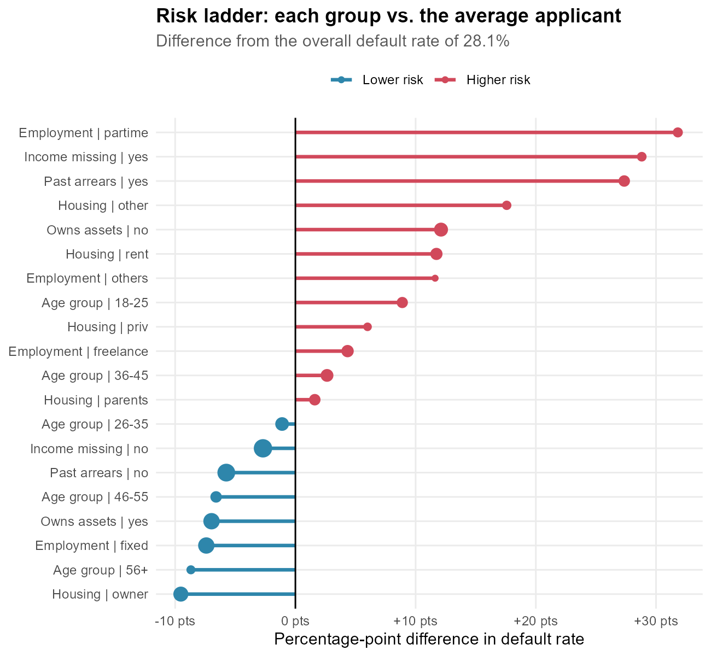
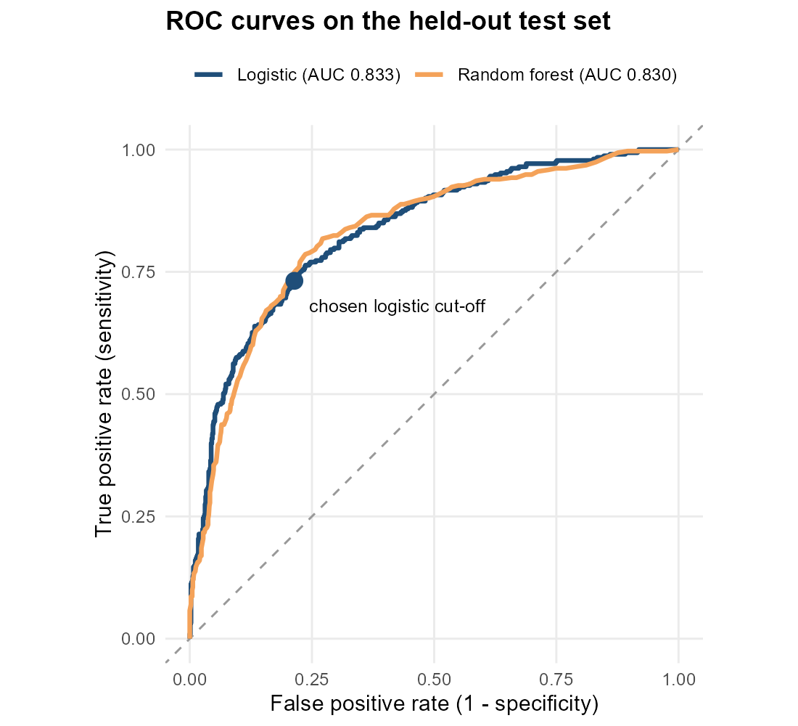
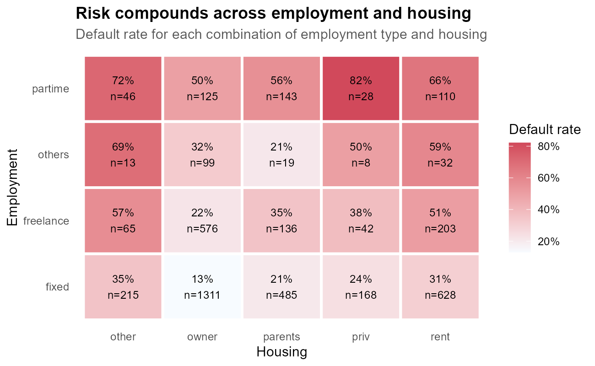
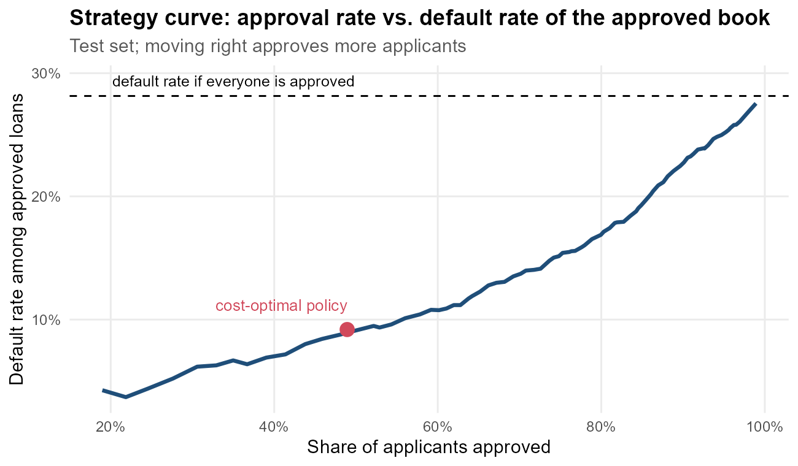

# data_analysis_R: Credit Default Analysis in R

An end-to-end data analysis project in R: cleaning a real-world dataset, communicating insights
visually, testing hypotheses, building a predictive model, and turning the results into business
recommendations.

**Author:** Nayani Paul

## Dataset
**Credit Scoring data**: 4,454 loan applicants and 14 variables (loan outcome good/bad, income,
assets, debt, loan amount, job, housing, arrears history, and more).
Source: Dr. L. A. Belanche Muñoz, via [gastonstat/CreditScoring](https://github.com/gastonstat/CreditScoring),
available in R as `modeldata::credit_data`.

## Project stages
| Stage | Script | Report |
|---|---|---|
| 1. Data cleaning & preliminary analysis | `R/week1_data_cleaning.R` | `reports/Week1_Data_Cleaning_Report.docx` |
| 2. Data visualization & insight communication | `R/week2_visualization.R` | `reports/Week2_Data_Visualization_Report.docx` |
| 3. Statistical analysis & predictive modeling | `R/week3_modeling.R` | `reports/Week3_Statistical_Modeling_Report.docx` |
| 4. Comprehensive final report | `R/week4_final_report.R` | `reports/Week4_Final_Comprehensive_Report.docx` |

Each script generates its Word report directly from R using `officer` and `flextable`, so every
table, chart and printed output in the reports comes straight from the code.

## Key results
- **Cleaning:** 2 duplicates removed; 415 incomplete rows imputed (job-group median income plus a missing-income flag); monetary outliers winsorized at the 1st/99th percentiles; 6 engineered features; one-hot encoding and scaling.
- **Risk drivers:** past arrears (55.5% vs 22.4% default rate), part-time work (60% vs 20.7% for fixed contracts), low job seniority, a high loan-to-price ratio, and undeclared income (57% vs 25.5%).
- **Statistics:** six hypothesis tests (Wilcoxon, Welch t, chi-square, correlation), all significant, with effect sizes reported.
- **Model:** logistic regression with repeated 10-fold cross-validation reaches a **test AUC of 0.833**, on par with a random forest (0.830). It is well calibrated (Hosmer-Lemeshow p = 0.21).
- **Business impact:** a cost-optimal approval cut-off lowers the default rate of approved loans from 28.1% to 9.2%. A–E risk grades range from 6% to 73% observed default.

## Sample outputs
| | |
|---|---|
|  |  |
|  |  |

## How to run
1. Install R (4.1 or newer) and RStudio.
2. Open `data_analysis_R.Rproj`.
3. Run `source("run_all.R")`. Missing packages are installed automatically. A full run takes about 5–8 minutes.

## Project structure
```
data_analysis_R/
├── run_all.R                 runs all four stages in order
├── R/
│   ├── 00_helpers.R          settings, plot theme, Word-report helpers
│   ├── week1_data_cleaning.R
│   ├── week2_visualization.R
│   ├── week3_modeling.R
│   └── week4_final_report.R
├── data/raw/                 untouched source data (CSV)
├── data/processed/           cleaned and model-ready data
├── outputs/figures/          all charts (PNG)
└── reports/                  generated Word reports
```

## Tools
R · dplyr · tidyr · ggplot2 · lattice · caret · randomForest · pROC · officer · flextable
